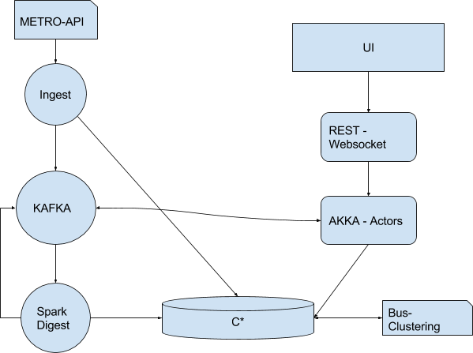
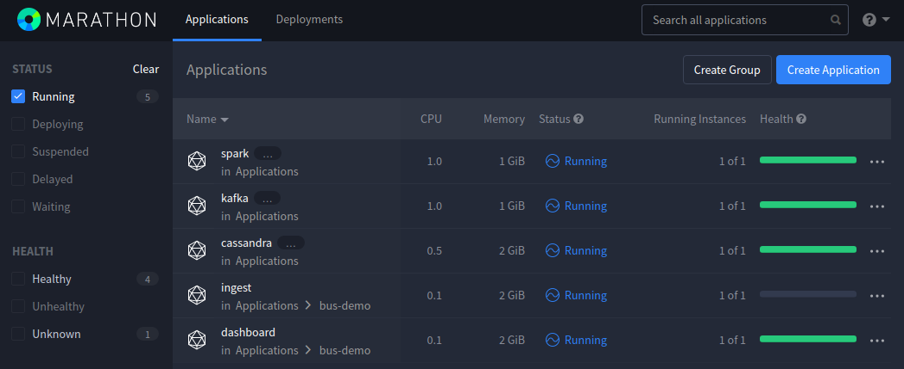

# Demo of SMACK based IoT on DCOS
Or how to run the SMACK stack on DC/OS with a stream of data.

This repo is based on [dcos/demo](https://github.com/dcos/demos/) and contains a scripted installation for DCOS. The orignal manual install steps and description is below to provide context.

NOTE: Scripts should only be used used in non production environments, i.e. demo

## Scripted Install
- Prerequisites below are required. Has been tested for DCOS 1.12.1
- Clone this repo locally. `git clone https://github.com/Boes-man/dcos-demo-iot-bus.git`
- Run install_fastdata-iot.sh eg `cd dcos-demo-iot-bus; ./install_fastdata-iot.sh`

## Known issues
- Intended to run on clean cluster. Running uninstall allows rerunning of install.
- Uninstall is not complete. So rerunning install after an uninstall may result in errors "Permission exists." "ERR_ACL_EXISTS" or "Could not reach the service scheduler with name spark" which (usually) can be ignored.

NOTE: The rest of the readme is for context only.
## Original Repo Description from here
This showcase is contributed by [Achim Nierbeck from codecentric](https://blog.codecentric.de/en/author/achim-nierbeck/), details can be found in the following blog posts:

 - [Iot Analytics Platform](https://blog.codecentric.de/en/2016/07/iot-analytics-platform/)
 - [SMACK Stack - DC/OS Style](https://blog.codecentric.de/en/2016/08/smack-stack-dcos-style/)

Code used in this demo can be found in the following code repository:

 - [github.com/ANierbeck/BusFloatingData](https://github.com/ANierbeck/BusFloatingData)

In short, with this showcase you'll receive live data from the Los Angeles METRO API.
The data is streamed to Apache Kafka and consumed by Apache Spark and an Akka application.

NOTE: As we are using live data from Los Angeles, there might be very few buses on the map during night in the PDT timezone.

**Table of Contents**

- [Architecture](#architecture)
- [Prerequisites](#prerequisites)
- [Install](#install) the demo
- [Use](#use) the demo

## Architecture
This is just an excerpt of details to be found in the following blog [Iot Analytics Platform](https://blog.codecentric.de/en/2016/07/iot-analytics-platform/)
The architecture splits into the following parts:
- Ingest – Akka
- Digest – Spark
- Backend – Akka
- UI – Javascript, Openstreetmap



The **ingestion** retrieves the data from an REST endpoint at the Los Angeles METRO API, and streams this
data into the Kafka. From there the data is **digested** by a Spark streaming job, and stored in a Cassandra NoSQL database.
This data which has been transformed for Cassandra (see blog post for the why), is now send back again to Kafka
and consumed by an Akka backendsystem. The UI Uses either REST or Websockets to retrieve the data from Cassandra
or Kafka via the Akka backendsystem.

## Prerequisites

- A running [DC/OS 1.11](https://dcos.io/releases/) or higher cluster with at least 4 private agents and 1 public agent each with 2 CPUs and 5 GB of RAM available as well as the [DC/OS CLI](https://docs.mesosphere.com/1.11/cli/) installed in version 0.14 or higher.
- The JSON query util [jq](https://github.com/stedolan/jq/wiki/Installation) must be installed.
- [SSH](https://docs.mesosphere.com/1.11/administering-clusters/sshcluster/) cluster access must be set up.

## Manual Install
### Spark

Install the DC/OS Apache Spark package (Version 1.0.2-2.0.0 or higher):

```bash
dcos package install spark
```

### Cassandra

Install DC/OS Apache Cassandra package:

```bash
dcos package install cassandra
```

Once it sucessfully deployed, check the dcos cassandra subcommand:

```bash
dcos cassandra endpoints native-client
```

The setup of the required cassandra schema is done via a [Jobs](https://docs.mesosphere.com/1.11/deploying-jobs/) job.

With the jobs frontend you're able to use the following configuration which will pull down a simple Docker Hub image with code from the [BusFloatingData](https://github.com/ANierbeck/BusFloatingData) repository and the [import_data.sh](bus-demo/import_data.sh) script.

```json
{
  "id": "init-cassandra-schema-job",
  "description": "Initialize cassandra database",
  "run": {
    "cmd": "/opt/bus-demo/import_data.sh node-0-server.cassandra.autoip.dcos.thisdcos.directory",
    "cpus": 0.1,
    "mem": 256,
    "disk": 0,
    "docker": {
      "image": "mesosphere/bus-demo-schema:3.0.7"
    }
  }
}
```

Another way of installing is by using the dcos cli.
For this use the [cassandra-schema.json](configuration/cassandra-schema.json) file.

Issue the following command line:
```bash
dcos job add configuration/cassandra-schema.json
dcos job run init-cassandra-schema-job
```

This will start a job, which initializes the configured cassandra.

### Kafka

Install the DC/OS Apache Kafka package:

```bash
dcos package install kafka
```

### Ingestion

Now that the basic SMACK infrastructure is available, let's start with the ingestion part of the setup.
Again there are two ways of installing this application - through the UI, or by using the DC/OS CLI.

Using the UI, copy and paste the JSON into the JSON editor:

```json
{
  "id": "/bus-demo/ingest",
  "cpus": 0.1,
  "mem": 2048,
  "disk": 0,
  "instances": 1,
  "container": {
    "type": "MESOS",
    "volumes": [],
    "docker": {
      "image": "mesosphere/akka-ingest:0.2.1-SNAPSHOT",
      "privileged": false,
      "parameters": [],
      "forcePullImage": true
    }
  },
  "env": {
    "CASSANDRA_CONNECT": "node-0-server.cassandra.autoip.dcos.thisdcos.directory:9042",
    "KAFKA_CONNECT": "broker.kafka.l4lb.thisdcos.directory:9092"
  }
}
```

For the client command use the dcos cli use the [akka-ingest.json](configuration/akka-ingest.json) file.
And issue the following commands:

```bash
dcos marathon app add configuration/akka-ingest.json
```

### Spark Jobs

The digestional part of the application is done via Spark jobs. To run those jobs you'll need to use the
dcos cli.

```bash
dcos spark run --submit-args='--driver-cores 0.1 --driver-memory 1024M --total-executor-cores 4 --class de.nierbeck.floating.data.stream.spark.KafkaToCassandraSparkApp https://oss.sonatype.org/content/repositories/snapshots/de/nierbeck/floating/data/spark-digest_2.11/0.2.1-SNAPSHOT/spark-digest_2.11-0.2.1-SNAPSHOT-assembly.jar METRO-Vehicles node-0-server.cassandra.autoip.dcos.thisdcos.directory:9042 broker.kafka.l4lb.thisdcos.directory:9092'
```

### Dashboard Application

The dasboard application will take care of the front end and the communication with Cassandra and Kafka.

Either install it via the DC/OS UI by creating a new marathon app:

```json
{
  "id": "/bus-demo/dashboard",
  "container": {
    "type": "MESOS",
    "docker": {
      "image": "mesosphere/akka-server:0.2.1-SNAPSHOT",
      "forcePullImage": true
    }
  },
  "acceptedResourceRoles": [
    "slave_public"
  ],
  "env": {
      "CASSANDRA_CONNECT": "node-0-server.cassandra.autoip.dcos.thisdcos.directory:9042",
      "KAFKA_CONNECT": "broker.kafka.l4lb.thisdcos.directory:9092"
  },
  "dependencies": ["/bus-demo/ingest"],
  "healthChecks": [
    {
      "path": "/",
      "protocol": "HTTP",
      "gracePeriodSeconds": 300,
      "intervalSeconds": 60,
      "timeoutSeconds": 20,
      "maxConsecutiveFailures": 3,
      "ignoreHttp1xx": false,
      "port": 8000
    }
  ],
  "cpus": 0.1,
  "mem": 2048.0,
  "ports": [
    8000, 8001
  ],
  "requirePorts" : true
}
```

or by using the DC/OS CLI and the [dashboard.json](configuration/dashboard.json) file.

```bash
dcos marathon app add configuration/dashboard.json
```

so after that you should have a nice list of applications:



## Use

Now that we successfully installed the application, let's take a look at the dashboard application.
For this we just need to navigate to the `http://$PUBLIC_AGENT_IP:8000/`.
Details about finding out how to find your public agent's ip can be found in the [documentation](https://docs.mesosphere.com/1.11/administering-clusters/locate-public-agent/).
The application will give you a
map where with every poll of the bus-data, that data is streamed into the map via a websocket connection.


Besides the real-time data streamed into the map, it's possible to request the data from the last 15 Minutes,
taken from the cassandra.

At this point may I point you again to the full blog about what can be done with this use-case at
 [Iot Analytics Platform](https://blog.codecentric.de/en/2016/07/iot-analytics-platform/). It will give you
 much better details about why the incoming x,y position data is combined to be in a quadkey.

You also can find some more details about the second use-case on with this showcase. How to use a
“Density-Based Clustering in Spatial Databases” (DBSCAN) grouping algorithm to find clusters of Busses, and
 to actually compute where there are major bus-stops.